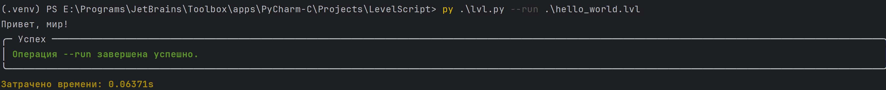
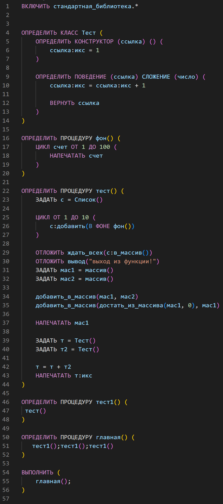

# Язык программирования: LevelScript!

[ Школа программирования LEVEL](https://levelschool.tilda.ws/)

[ Статья на Habr](https://habr.com/ru/articles/1025306/)

[](https://deepwiki.com/LVL-SCHOOL/LevelScript)

Школа программирования LEVEL представляет язык программирования LevelScript! 
Данный язык программирования рассчитан на детей от 8 до 16 лет

### Философия языка

LevelScript сочетает в себе интуитивно понятный синтаксис, который читается как обычный текст, и при этом обладает выразительной мощью грамматических конструкций. 
На нём можно создавать что угодно: от простых игр и Telegram-ботов до полноценных серверов!

[Примеры кода](./examples)


## Сырой запуск:


### Windows
```
py -m venv .venv 
.venv/Scripts/activate
set PYTHONPATH=%CD%
pip install -r requirements.txt
py lvl.py --run hello_world.lvl
```

### Linux/Mac

#### ВАЖНО! На маке могут потребоваться "танцы с бубном!"

```
py -m venv .venv 
.venv/Scripts/activate
export PYTHONPATH=$(pwd)
pip install -r requirements.txt
py lvl.py --run hello_world.lvl
```

## Сборка(Windows):

```
build.bat
```

### Запуск exe

```
lvl.exe --run hello_world.lvl
```

Если Вы увидете такой вывод: 



Значит LevelScript работает штатно!

### Конфигурация

Для настройки LevelScript создайте файл lvl_config.env

## Пример кода




## Пример обработки ошибок

----
Язык понимает, что вы имели в виду, даже когда вы ошибаетесь!


----
Не переданные аргументы


----
Одинаковые аргументы


----
Двойное ожидание фоновой задачи


----
Хорошо понимает контекст ошибки. Показывает конкретное выражение


----
В рамках выражений, тоже хорошо понимает, что сломалось


